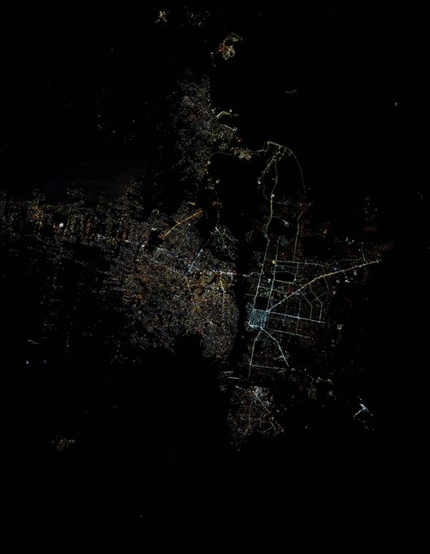

# Programación con objetos I
## Nazareno Ateca Del Pozo

Buenas, me llamo Nazareno y este es mi segundo año en la universidad. Curse Ing. en Sistemas en la UTN por 3 años pero decidi cambiarme por conveniencia.

Estoy trabajando en IBM desde el 2022, primero ingrese como pasante y luego consegui quedar como empleado a tiempo completo. Estoy en el area de Expert Labs, en el Team Watson. Nos encargamos de desarrollar e implementar soluciones con IA para los clientes.

Me gusta la Ingenieria en general. Me apasiona todo lo que tenga que ver con la exploracion espacial.

Para acompañar la presentacion, dejo una foto que me encanta de la Triple frontra Argentina-Paraguay-Brasil, tomada desde la Estacion Espacial Internacional por el Astronauta estadounidense Donald R. Pettit.

